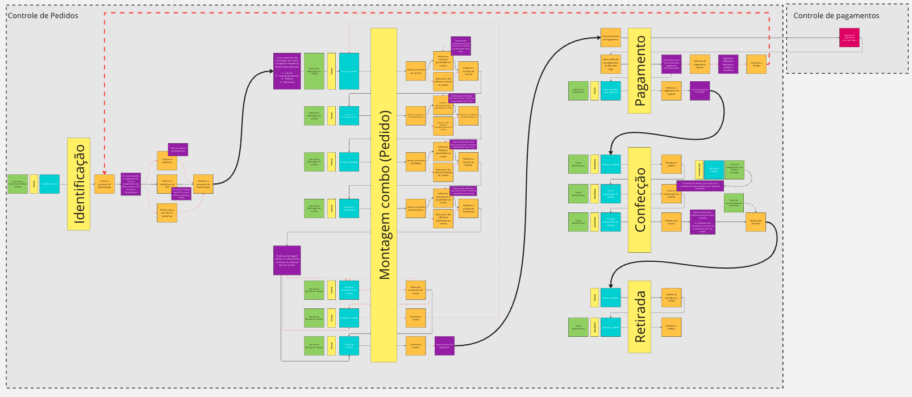
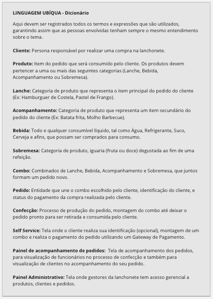
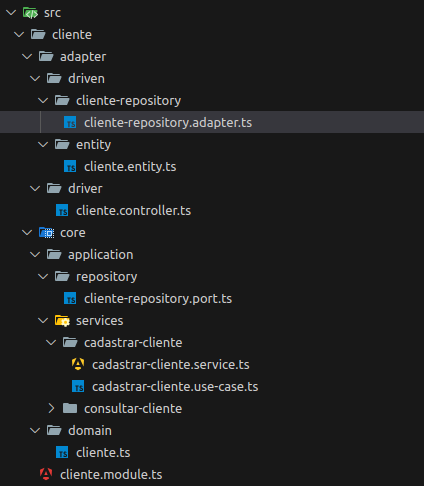
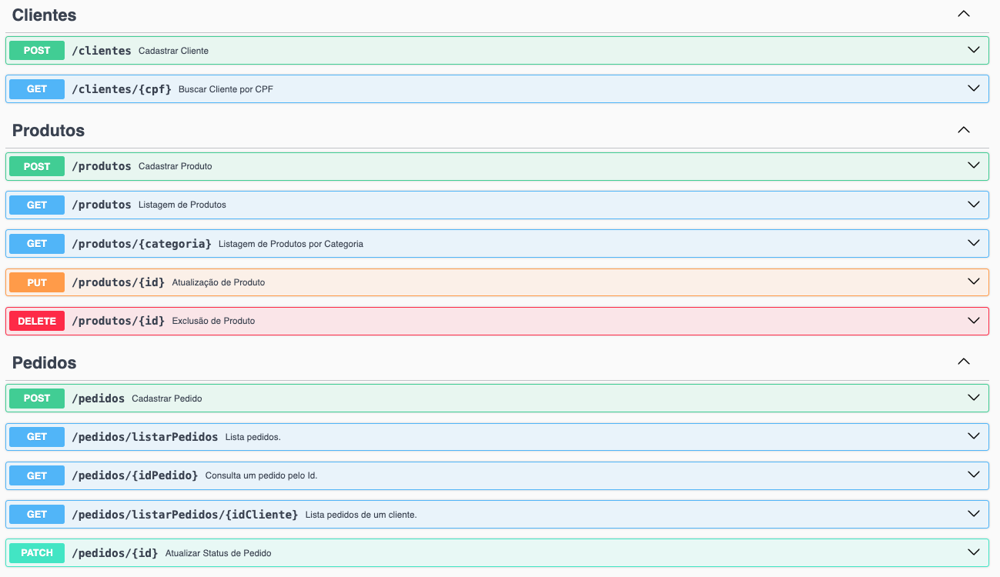

# Entrega Tech Challenge

### **Grupo 37**

**Integrantes**

Lucas Leal - **RM355575** - [leallucasfonseca@gmail.com](mailto:leallucasfonseca@gmail.com)

Merhy Omar Daychoum - **RM356180** - [merhydaychoum@gmail.com](mailto:merhydaychoum@gmail.com)

Wanderson Pereira - **RM356410** - [wanderson.p.ayres@gmail.com](mailto:wanderson.p.ayres@gmail.com)

Jackson Carbonera - **RM354963** - [jwccarbonera@outlook.com](mailto:jwccarbonera@outlook.com)

### Sistema de Controle de Pedidos para Lanchonetes:

**Objetivo:**

O sistema tem como objetivo principal facilitar e otimizar o gerenciamento de pedidos em lanchonetes. Ele oferece diversas funcionalidades para agilizar o processo de venda, desde a identificação do cliente até a entrega do pedido.

**Funcionalidades:**

- **Gerenciamento de Pedidos:**
   - Criação e gerenciamento de pedidos.
   - Identificação dos clientes por CPF (opcional).
   - Definição dos itens do combo a partir de diferentes categorias de produtos.
   - Acompanhamento do status do pedido em tempo real, desde sua realização até a entrega.
- **Cardápio Completo:**
   - Organização dos produtos por categorias.
   - Os clientes podem criar seus próprios combos conforme os produtos.
- **API Gerencial:**
   - Cadastro e atualização dos produtos.
   - Gerenciamento dos pedidos.

### **Entregáveis**

1. **Documentação DDD**

   Documentação do sistema (DDD) com Event Storming está disponível através do Miro no link: [https://miro.com/app/board/uXjVKYcLnRc=/](https://miro.com/app/board/uXjVKYcLnRc=/)




Event Storming produzido pelo grupo.



Linguagem Ubíqua utilizada pelo grupo.

1. **Código da aplicação**

   O repositório da aplicação está disponível no github através do link: https://github.com/jacksonwc2/fiap-self-service
   
   O projeto foi construído utilizando o framework [NestJS](https://docs.nestjs.com/) que possibilita modularizar os subdomínios da aplicação, ou seja, conforme os requisitos do tech challenge, temos os principais módulos, sendo eles, Cliente, Produto e Pedido.
   
   Cada módulo possui uma hierarquia de diretórios para melhor adequar os componentes da arquitetura hexagonal.
   
   Como podemos observar, cada módulo possui um diretório chamado core, onde definimos o domínio da aplicação, ou seja, nossas entidades, casos de uso, services, e interfaces para representar portas externas ao core da aplicação.
   
   O módulo também conta com o diretório chamado adapter que por sua vez contém as implementações das portas de entrada e saída para o core da aplicação, ou seja, os diretórios driven e driver.
   
   A estrutura do módulo de cliente é reutilizada em todos os módulos e pode ser observada na imagem abaixo:




Estrutura de pastas da aplicação.

   Conforme os requisitos, foi disponibilizado a documentação via Swagger para consumo das APIs.
   As APIs contemplam cadastro e identificação de clientes, gerenciamento de produtos e pedidos.
   Observe que os endpoints de checkout de pedidos se trara do cadastro e atualização de status via API.



Rotas da aplicação demonstradas no swagger.

### Passo a passo docker compose

1. Fazer o clone do projeto:

```bash
git clone git@github.com:jacksonwc2/fiap-self-service.git
```

1. Navegar até a pasta raiz do projeto e executar o comando:

```bash
docker compose up -d
```

1. Para acessar o swagger do projeto colocar no navegador:

```bash
localhost:3000/api
```

### Passo a passo local

Requisito para rodar o projeto localmente é ter instalado em sua máquina a versão 20 do node.

Passo a passo para instalação do node

### **Windows**

1. **Baixar o instalador:**
    - Vá até a página de downloads do Node.js.
    - Baixe o instalador da versão 20 do Node.js para Windows (arquivo .msi).
2. **Executar o instalador:**
    - Dê um duplo clique no arquivo baixado para iniciar o instalador.
    - Siga as instruções na tela para completar a instalação. Você pode optar por instalar os componentes adicionais recomendados.
3. **Verificar a instalação:**
    - Abra o Prompt de Comando (cmd) ou PowerShell.
    - Execute **`node -v`** para verificar a versão instalada do Node.js.
    - Execute **`npm -v`** para verificar a versão do npm, o gerenciador de pacotes do Node.js.

### **macOS**

1. **Usar o Homebrew (recomendado):**
    - Se você não tem o Homebrew instalado, instale-o seguindo as instruções na [página oficial do Homebrew](https://brew.sh/).
    - Abra o Terminal.
    - Execute **`brew install node@20`** para instalar o Node.js versão 20.
2. **Verificar a instalação:**
    - Execute **`node -v`** para verificar a versão instalada do Node.js.
    - Execute **`npm -v`** para verificar a versão do npm.

### **Linux**

Para distribuições baseadas em Debian (como Ubuntu):

1. **Adicionar o repositório NodeSource:**
    - Abra o Terminal.
    - Execute os seguintes comandos para adicionar o repositório e instalar o Node.js 20:

        ```bash
        bashCopy code
        curl -fsSL https://deb.nodesource.com/setup_20.x | sudo -E bash -
        sudo apt-get install -y nodejs
        ```

2. **Verificar a instalação:**
    - Execute **`node -v`** para verificar a versão instalada do Node.js.
    - Execute **`npm -v`** para verificar a versão do npm.

Para outras distribuições, como Fedora:

1. **Adicionar o repositório NodeSource:**
    - Abra o Terminal.
    - Execute os seguintes comandos para adicionar o repositório e instalar o Node.js 20:

        ```bash
        bashCopy code
        curl -fsSL https://rpm.nodesource.com/setup_20.x | sudo bash -
        sudo dnf install -y nodejs
        
        ```

2. **Verificar a instalação:**
    - Execute **`node -v`** para verificar a versão instalada do Node.js.
    - Execute **`npm -v`** para verificar a versão do npm.

### **Usando o nvm (Node Version Manager)**

Uma alternativa para todos os sistemas operacionais é usar o nvm, que permite gerenciar múltiplas versões do Node.js:

1. **Instalar o nvm:**
    - Siga as instruções no [repositório oficial do nvm no GitHub](https://github.com/nvm-sh/nvm#installing-and-updating).
2. **Instalar o Node.js 20:**
    - Após instalar o nvm, abra um novo terminal e execute:

        ```bash
        bashCopy code
        nvm install 20
        nvm use 20
        ```

3. **Verificar a instalação:**
    - Execute **`node -v`** para verificar a versão instalada do Node.js.
    - Execute **`npm -v`** para verificar a versão do npm.

Seguindo esses passos, você terá o Node.js 20 instalado e pronto para uso no seu sistema operacional.

1. **Fazer o clone do projeto:**

    ```bash
    git clone git@github.com:jacksonwc2/fiap-self-service.git
    ```


1. **Navegar até a pasta raiz do projeto e instalar as dependencias necessárias da aplicação com o comando:**

    ```bash
    npm install
    ```


1. **Subir o banco de dados com o comando:**

    ```bash
    docker compose up -d fiap-self-service-db-mysql
    ```


1. **Rodar o projeto localmente através do comando:**

    ```bash
    npm run start:dev
    ```