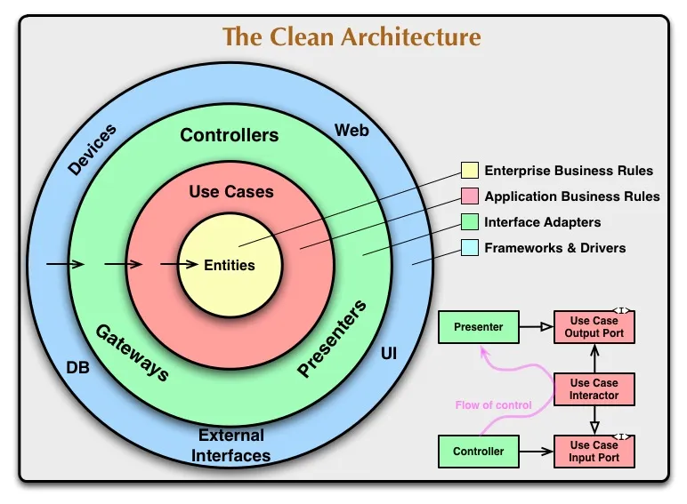
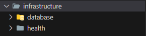
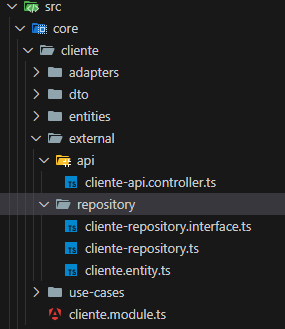
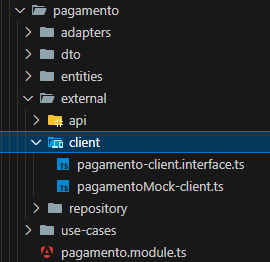
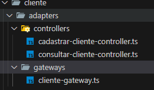
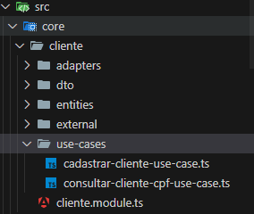
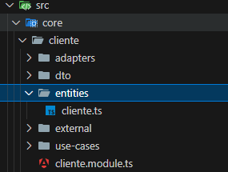

# Clean Architecture
### Design de software

Nossa aplicação é construida com node e utiliza o framework NestJS, que por sua vez disponibiliza uma estrutura modularizada de componentes para nossa aplicação.
Essa modularização nos possibilita adequar e trabalhar com DDD e Clean architecture de forma agil e organizada.

NestJS e Clean Architecture é muito conhecido na comunidade, inclusive, temos inumeros projetos que podem ser usados como referencia para adequação e aplicação dos pilares da Clean Architecture, como por exemplo:

* https://blog.cleancoder.com/uncle-bob/2012/08/13/the-clean-architecture.html

* https://github.com/FIAP/POSTECH_SOAT_CleanArchitecture/tree/main/aula_08/src

* https://github.com/royib/clean-architecture-nestJS/tree/main/src/use-cases

* https://medium.com/@jonathan.pretre91/clean-architecture-with-nestjs-e089cef65045

* https://github.com/devfullcycle/live-imersao-15-nestjs-clean-arch

## Como adequamos o design da aplicação a Clean Architecture? 

Após entendimento dos objetivos da clean architeture e saber que devemos adequar a melhor arquitetura possível ao dominio da nossa aplicação, chegamos as seguintes cadas da nossa aplicação.

### Frameworks and Drivers

Essa camada da aplicação, contem arquivos de configurações genericas do framework e conexões externas, como por exemplo, acesso ao banco de dados, mensagearia, APIs da aplicação, decorators e outras particularidades do framework.

Em nossa aplicação, esta camada de arquitetura é encontrada em:

**src/infraestructure**

Para aproveitarmos a modularização de componentes propostas pelo NestJS, iremos criar modulos e diretórios para representar dominios e subdominos da nossa aplicação, colocando em prática os conceitos do DDD.

Dessa forma, teremos na raiz do projeto um diretório contendo os dominios e modulos da nossa aplicação.

**src/core**

Dentro da estrutura de cada módulo/domínio teremos o diretório **external** que representa a camada de **Frameworks and Drivers** para o dominio especifico da aplicação.

Como pode ser observado na imagem, o diretório external possui dois sub-diretórios, sendo eles:

* **/api**: Camada do framework que expõem uma API rest, como porta de entrada para aplicação. Podemos notar o uso do termo **[...]-api.controller.ts**, ou seja, utilizamos o termo controller que é adotado pelo framework para referenciar ao acesso a API rest e não ao termo **Controllers** abordado pelo Clean Architecture.

* **/repository**: Camada da aplicação que define repositório de dados e expõem uma interface para acesso ao serviço de banco de dados e entidades TypeORM.

Dessa forma, a camada **Frameworks and Drivers** é encontrada de forma generalizada na raiz do projeto e também nos módulos de dominios da aplicação.

### Interface Adapters

Conjunto de adaptadores que convertem dados do formato mais conveniente para os casos de uso e entidades, para o formato mais conveniente para componentes externos.

Esta camada é responsável pela comunicação entre casos de uso e drivers externos da aplicação, como por exemplo, acessos ao banco de dados via Gateway e acessos da API rest aos casos de uso via Controllers.

### Use Cases

Camada que contem as regras de negócio da nossa aplicação. Essa camada trabalha com as entidades de dominio da nossa aplicação e se comunica com Gateways para comunicações externas.

### Entities

Camada da aplicação que contem objetos com métodos ou conjunto de estruturas de dados e funções. Estas classes representam os domínios de negócios da aplicação.

## Conclusão

É importante notar de que não existe uma arquitetura totalmente correta ou incorreta, mas sim, uma adaptação da necessidade tecnicas e negociais ao design da aplicação que estamos desenvolvendo.

Um exemplo é o uso de **presenters**, o qual não foi necessário para o projeto. Isso porque estamos trabalhando com uma API que consome e produz conteudos JSON e essa conversão de objetos para JSON acontece de forma transparente no uso do framework. Se fosse necessário expor dois endpoints que executassem o mesmo caso de uso, mas com retornos formatados de formas diferente, como por exemplo, JSON, XML ou PDF, teriamos a aplicação de presenters para solução do cenário apresentado.

Com base no contexto apresentado, concluimos que a modularização dos componentes de software, diretórios, classes, interfaces e suas integrações se adequam aos principios propostos pela Clean Architecture. 