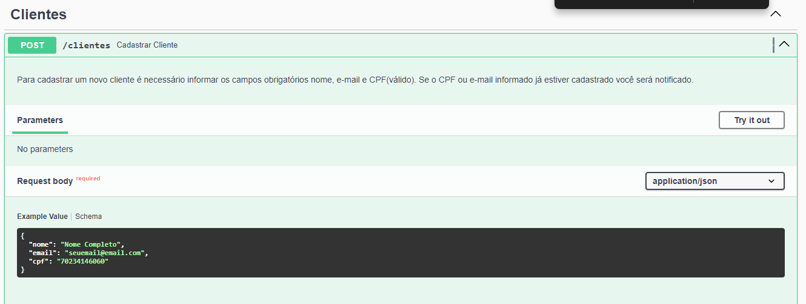
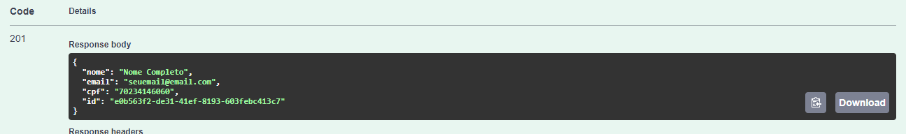
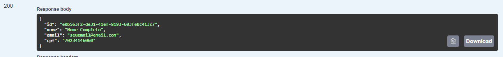
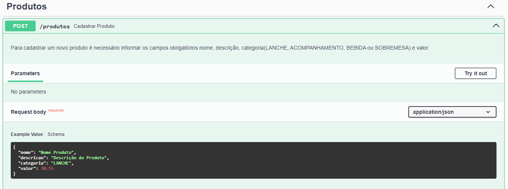
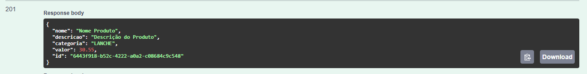
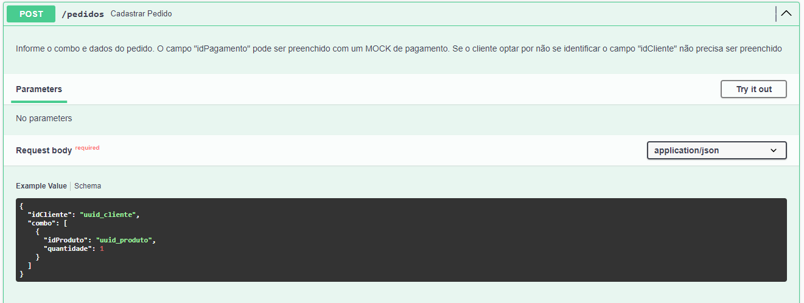
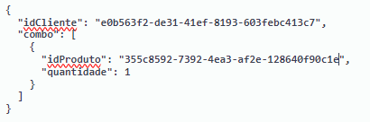
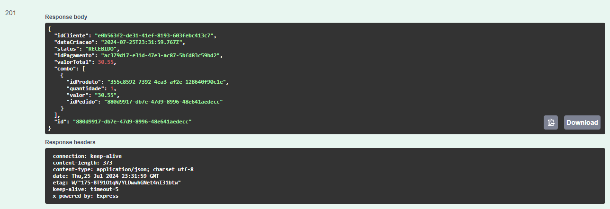
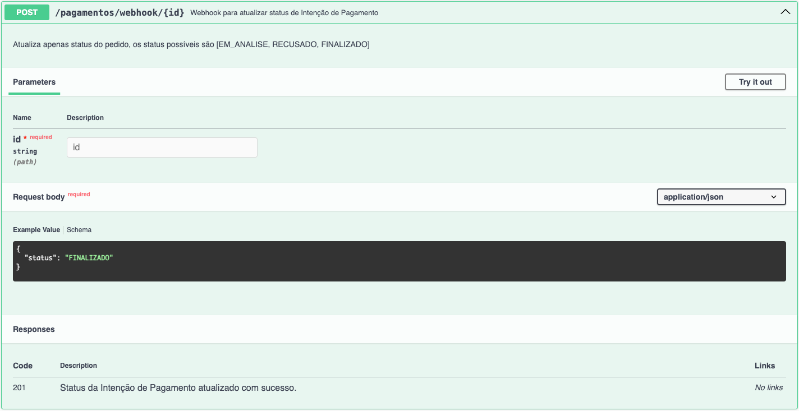
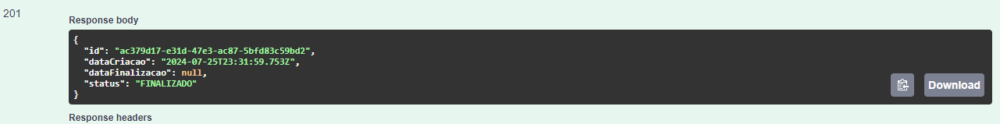

# Guia de Fluxos da API

Este documento, tem como objetivo exemplificar o fluxo de criação de pedido e finalização do mesmo, envolvendo cliente, produtos e pagamentos.

## Cadastrar Cliente

Antes de realizar um pedido, de forma opcional, você pode cadastrar um cliente usando a api POST /clientes

* http://localhost:3000/api#/Clientes/ClienteAPIController_cadastrarCliente

Se necessário, você pode utilizar a api GET /clientes/{cpf} para recuperar o cliente

* http://localhost:3000/api#/Clientes/ClienteAPIController_buscarClientePorCPF

## Cadastrar produtos

Antes de realizar um pedido, de forma obrigatória, você deve cadastrar um produtos usando a api POST /produtos

* http://localhost:3000/api#/Produtos/ProdutoAPIController_cadastarProduto

Além deste endpoint, se necessário você pode estar pesquisando, editando ou removendo os produtos já cadastrados:

* http://localhost:3000/api#/Produtos/ProdutoAPIController_listarProdutos

* http://localhost:3000/api#/Produtos/ProdutoAPIController_buscarProdutoPorCategoria

* http://localhost:3000/api#/Produtos/ProdutoAPIController_editarProduto

* http://localhost:3000/api#/Produtos/ProdutoAPIController_deletarProduto

## Cadastrar pedidos

Você pode criar um novo pedido utilizando o endpoint POST /pedidos

* http://localhost:3000/api#/Pedidos/PedidoAPIController_cadastrarPedido

**Observação:** Lembre-se de alterar os ids de exemplos do swagger para utilizar os IDs criados pelas APIs anteriores de clientes e produtos.

Observe que ao criar o pedido é retornado os dados do mesmo, inclusive o identificador do pagamento que deve ser atualizado pelo webhook para alterar o status do pedido.

Além deste endpoint, se necessário você pode estar pesquisando e atualizando os status do pedido:

* http://localhost:300/api#/Pedidos/PedidoAPIController_listarPedidos

* http://localhost:300/api#/Pedidos/PedidoAPIController_consultarPedidoPorId

* http://localhost:300/api#/Pedidos/PedidoAPIController_listarPedidoPorIdCliente

* http://localhost:300/api#/Pedidos/PedidoAPIController_atualizarStatusPedido

## Webhook para pagamento do pedidos

Após criar um novo pedido você deve acionar o webhook POST /pagamentos/{id}

* http://localhost:3000/api#/Pagamentos/PagamentosAPIController_atualizarStatusIntencaoPagamento

**Observação:** Lembre-se de alterar os id de exemplo do swagger para utilizar os ID do pagamento retornado pelo endpoint de criação do pedido executado anteriormente.

Após a execução deste endpoint o status do pedido será atualizado e você pode continuar com as atualizações dos status de pedidos utilizando o endpoint PATCH /pedidos/{id}

* http://localhost:3000/api#/Pedidos/PedidoAPIController_atualizarStatusPedido

Você pode consultar os dados do pagamento utilizando o endpoint GET /pagamentos/{id}

* http://localhost:3000/api#/Pagamentos/PagamentosAPIController_consultarPedidoPorId

## Conclusão

Com base no contexto apresentado, concluimos que a documentação das APIs e fluxos apresentados para as requisições dos endpoints é capaz de exemplificar como o projeto deve ser utilizado para o gerenciamento de pedidos por uma lanchonete.